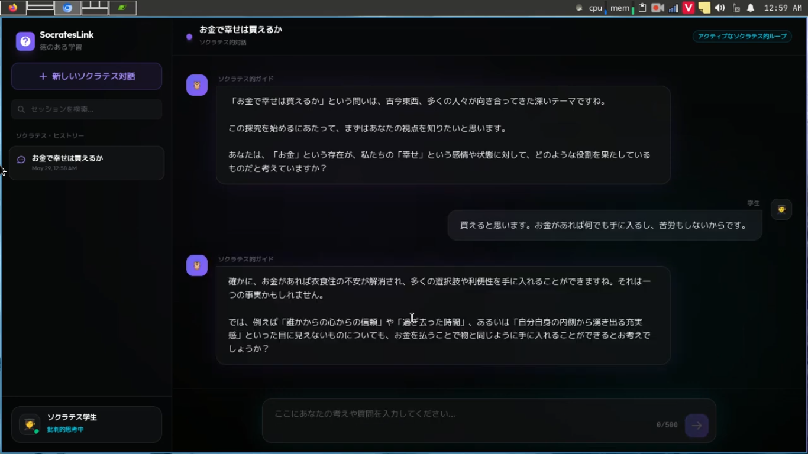

<!-- Improved compatibility of back to top link: See: https://github.com/othneildrew/Best-README-Template/pull/73 -->
<a id="readme-top"></a>

[![Contributors][contributors-shield]][contributors-url]
[![Forks][forks-shield]][forks-url]
[![Stargazers][stars-shield]][stars-url]
[![Issues][issues-shield]][issues-url]
[![project_license][license-shield]][license-url]
[![LinkedIn][linkedin-shield]][linkedin-url]

<br />
<div align="center">
  <!-- <a href="https://github.com/duykhanh472/sokurin">
    
  </a> -->


<h3 align="center">SocratesLink</h3>

  <p align="center">
    A Socratic-style AI tutoring interface with a Svelte frontend and Node/Express backend.
    <br />
    <a href="#usage"><strong>Explore the app »</strong></a>
    <br />
    <br />
    <a href="#getting-started">Get Started</a>
    &middot;
    <a href="#contributing">Contributing</a>
    &middot;
    <a href="#license">License</a>
  </p>
</div>

<iframe width="560" height="315" src="https://www.youtube.com/embed/9xP1J309koQ?si=CvUOfu9VGD9AzdaE" title="YouTube video player" frameborder="0" allow="accelerometer; autoplay; clipboard-write; encrypted-media; gyroscope; picture-in-picture; web-share" referrerpolicy="strict-origin-when-cross-origin" allowfullscreen></iframe>

<details>
  <summary>Table of Contents</summary>
  <ol>
    <li>
      <a href="#about-the-project">About The Project</a>
      <ul>
        <li><a href="#built-with">Built With</a></li>
      </ul>
    </li>
    <li>
      <a href="#getting-started">Getting Started</a>
      <ul>
        <li><a href="#prerequisites">Prerequisites</a></li>
        <li><a href="#installation">Installation</a></li>
      </ul>
    </li>
    <li><a href="#usage">Usage</a></li>
    <li><a href="#roadmap">Roadmap</a></li>
    <li><a href="#contributing">Contributing</a></li>
    <li><a href="#license">License</a></li>
    <li><a href="#contact">Contact</a></li>
    <li><a href="#acknowledgments">Acknowledgments</a></li>
  </ol>
</details>

## About The Project



SocratesLink is a fullstack learning assistant that uses a Svelte + Vite frontend with an Express backend. It presents a Socratic tutoring experience by asking guided questions, maintaining conversation history, and optionally using Google Gemini or OpenAI for natural language responses.

<p align="right">(<a href="#readme-top">back to top</a>)</p>

### Built With

* [![Svelte][Svelte.dev]][Svelte-url]
* [![Vite][Vite]][Vite-url]
* [![Tailwind CSS][Tailwind.css]][Tailwind-url]
* [![Node.js][Node.js]][Node-url]
* [![Express][Express.js]][Express-url]

<p align="right">(<a href="#readme-top">back to top</a>)</p>

## Getting Started

Follow these instructions to get a local copy up and running.

### Prerequisites

* Node.js 18+ installed
* npm installed
* Optional: a Google Gemini or OpenAI API key for full AI-enabled Socratic responses

### Installation

1. Clone the repo
   ```sh
   git clone https://github.com/duykhanh472/sokurin.git
   cd SocratesLink
   ```
2. Install root dependencies if needed
   ```sh
   npm install
   ```
3. Install backend and frontend dependencies
   ```sh
   npm install --prefix backend
   npm install --prefix frontend
   ```
4. Create a `.env` file inside `/backend`
   ```env
   GEMINI_API_KEY=your_google_gemini_api_key
   OPENAI_API_KEY=your_openai_api_key
   ```
   If neither key is configured, the backend will use a local Socratic fallback engine.

### Run Locally

Start the backend and frontend together from the repository root:

```sh
npm run dev
```

Or run each side independently:

```sh
npm run dev:backend
npm run dev:frontend
```

The frontend is served by Vite and the backend listens on `http://localhost:3000`.

<p align="right">(<a href="#readme-top">back to top</a>)</p>

## Usage

1. Open the app in your browser via the Vite frontend URL.
2. Enter a topic to start a new Socratic session.
3. Send messages and receive guided, question-driven responses.
4. Use the session sidebar to revisit or delete past conversations.

This app is designed for educational exploration and reflection rather than direct answer delivery.

<p align="right">(<a href="#readme-top">back to top</a>)</p>

## Roadmap

- [ ] Add persistence for session history beyond in-memory storage
- [ ] Improve AI prompt handling and multi-turn context management
- [ ] Add user authentication and saved learning paths
- [ ] Support deployment configuration for production hosting

See the open issues on GitHub for feature proposals and bugs.

<p align="right">(<a href="#readme-top">back to top</a>)</p>

## Contributing

Contributions are welcome! To contribute:

1. Fork the project
2. Create your feature branch (`git checkout -b feature/AmazingFeature`)
3. Commit your changes (`git commit -m 'Add some AmazingFeature'`)
4. Push to the branch (`git push origin feature/AmazingFeature`)
5. Open a pull request

<p align="right">(<a href="#readme-top">back to top</a>)</p>

## License

No license specified. Add a `LICENSE` file or update this section as needed.

<p align="right">(<a href="#readme-top">back to top</a>)</p>

## Contact

Project maintainer - [@twitter_handle](https://twitter.com/twitter_handle) - email@email_client.com

Project Link: [https://github.com/duykhanh472/sokurin](https://github.com/duykhanh472/sokurin)

<p align="right">(<a href="#readme-top">back to top</a>)</p>

## Acknowledgments

* [Svelte](https://svelte.dev/)
* [Vite](https://vitejs.dev/)
* [Tailwind CSS](https://tailwindcss.com/)
* [OpenAI](https://openai.com/)
* [Google Gemini](https://developers.generativeai.google/)

<p align="right">(<a href="#readme-top">back to top</a>)</p>

[contributors-shield]: https://img.shields.io/github/contributors/duykhanh472/sokurin.svg?style=for-the-badge
[contributors-url]: https://github.com/duykhanh472/sokurin/graphs/contributors
[forks-shield]: https://img.shields.io/github/forks/duykhanh472/sokurin.svg?style=for-the-badge
[forks-url]: https://github.com/duykhanh472/sokurin/network/members
[stars-shield]: https://img.shields.io/github/stars/duykhanh472/sokurin.svg?style=for-the-badge
[stars-url]: https://github.com/duykhanh472/sokurin/stargazers
[issues-shield]: https://img.shields.io/github/issues/duykhanh472/sokurin.svg?style=for-the-badge
[issues-url]: https://github.com/duykhanh472/sokurin/issues
[license-shield]: https://img.shields.io/github/license/duykhanh472/sokurin.svg?style=for-the-badge
[license-url]: https://github.com/duykhanh472/sokurin/blob/master/LICENSE.txt
[linkedin-shield]: https://img.shields.io/badge/-LinkedIn-black.svg?style=for-the-badge&logo=linkedin&colorB=555
[linkedin-url]: https://linkedin.com/in/linkedin_username
[product-screenshot]: images/screenshot.png
[Svelte.dev]: https://img.shields.io/badge/Svelte-4A4A55?style=for-the-badge&logo=svelte&logoColor=FF3E00
[Svelte-url]: https://svelte.dev/
[Vite]: https://img.shields.io/badge/Vite-646cff?style=for-the-badge&logo=vite&logoColor=white
[Vite-url]: https://vitejs.dev/
[Tailwind.css]: https://img.shields.io/badge/Tailwind_CSS-06B6D4?style=for-the-badge&logo=tailwind-css&logoColor=white
[Tailwind-url]: https://tailwindcss.com/
[Node.js]: https://img.shields.io/badge/Node.js-339933?style=for-the-badge&logo=node.js&logoColor=white
[Node-url]: https://nodejs.org/
[Express.js]: https://img.shields.io/badge/Express-000000?style=for-the-badge&logo=express&logoColor=white
[Express-url]: https://expressjs.com/